<div align="center">

# JobPortal

**A modern, role-based job board built with React 19, Vite 7 and Tailwind CSS 4.**

Job seekers search, save and apply for jobs. Employers post jobs and review applicants. Admins manage companies, employers and contact messages. Everything runs in the browser with a simulated API, so there is nothing to set up.


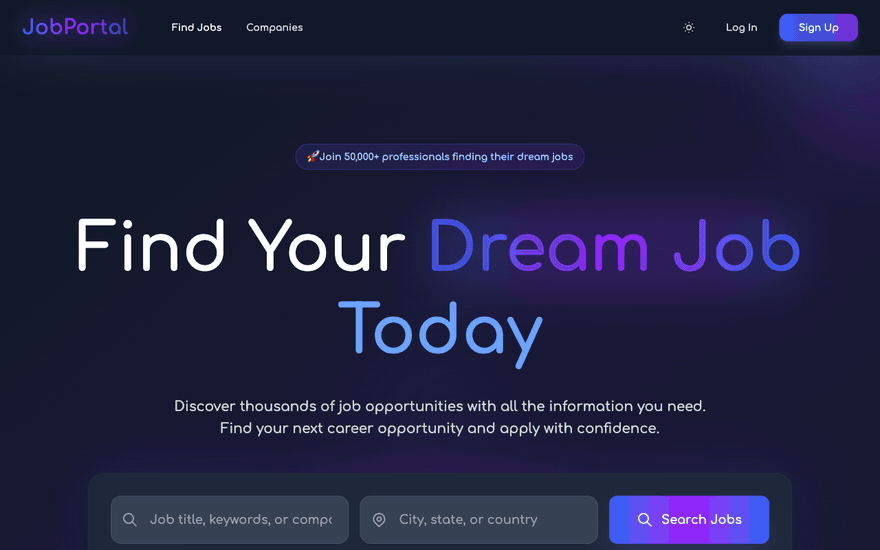

</div>

---

## Table of Contents

- [Screenshots](#screenshots)
- [Features](#features)
- [Tech Stack](#tech-stack)
- [Getting Started](#getting-started)
- [Demo Accounts](#demo-accounts)
- [Available Scripts](#available-scripts)
- [Project Structure](#project-structure)
- [Architecture](#architecture)
- [Contributing](#contributing)
- [License](#license)

## Screenshots

All screenshots are taken in dark mode with the built-in mock data.

### Browse

| Job search | Job details |
| :---: | :---: |
| 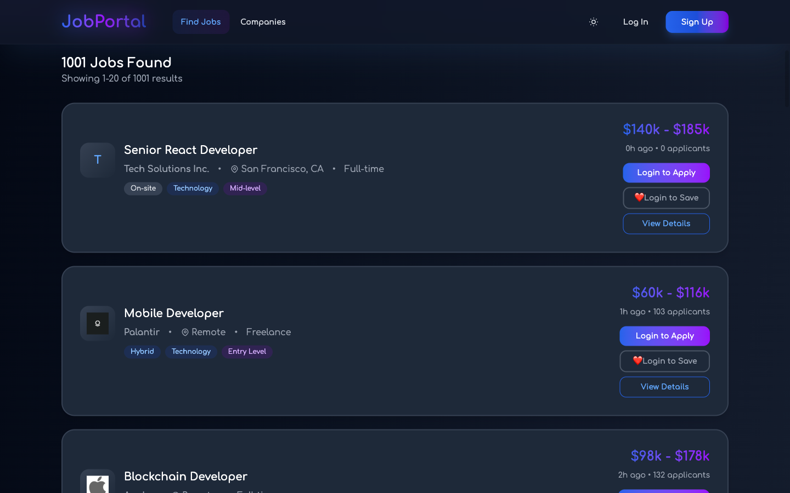 | 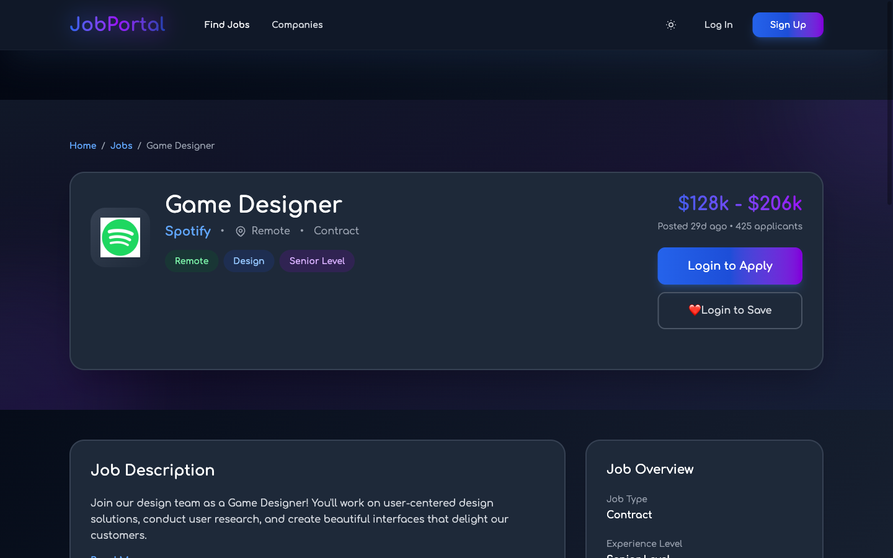 |
| **Companies** | **Company profile** |
| 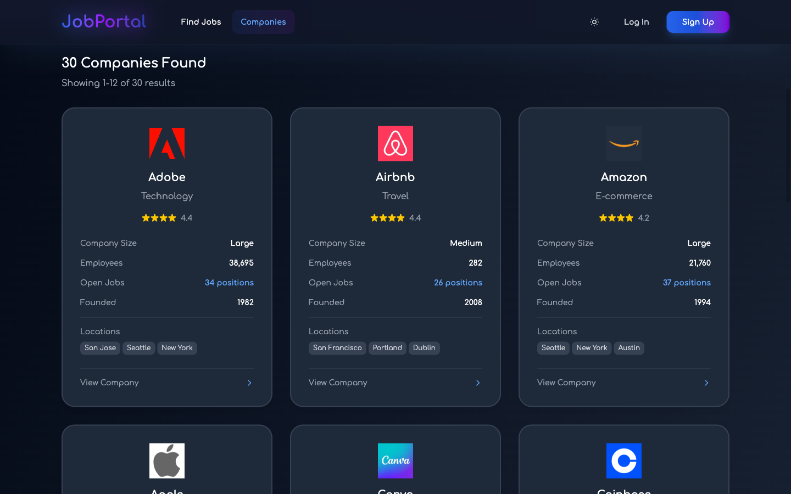 | 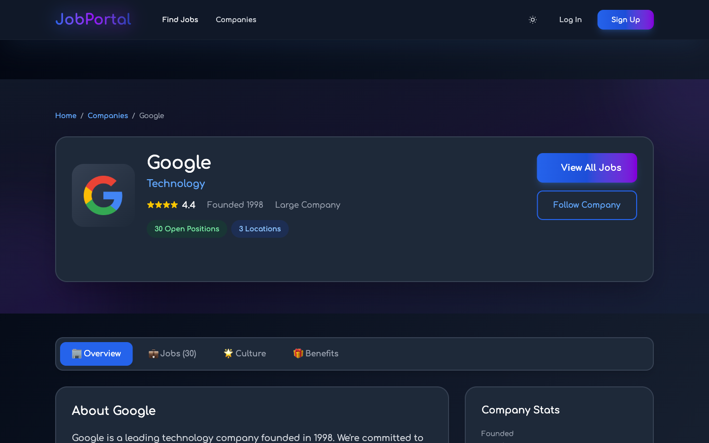 |

### Job seeker

| Applied jobs | Saved jobs |
| :---: | :---: |
| 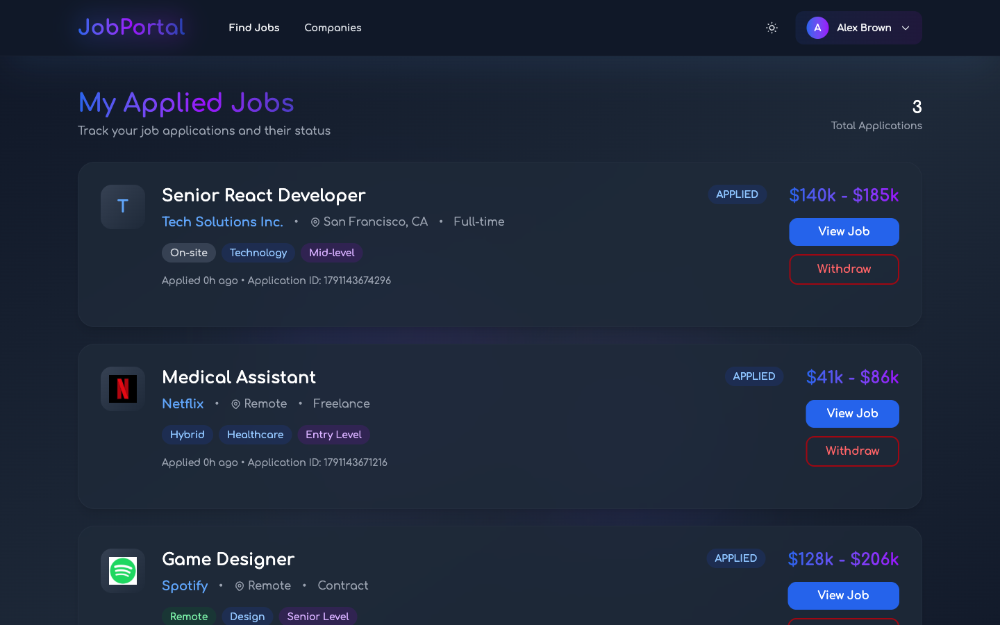 | 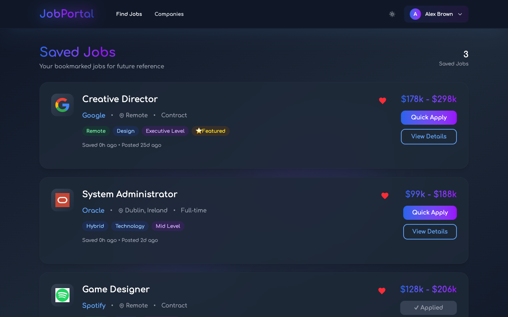 |

### Employer

| My posted jobs | Post a job |
| :---: | :---: |
| 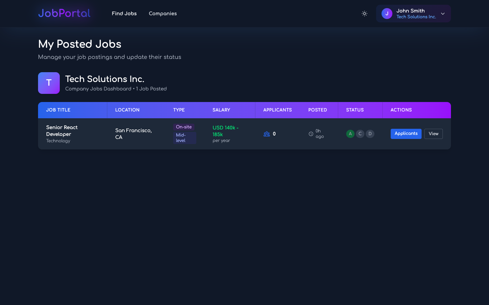 | 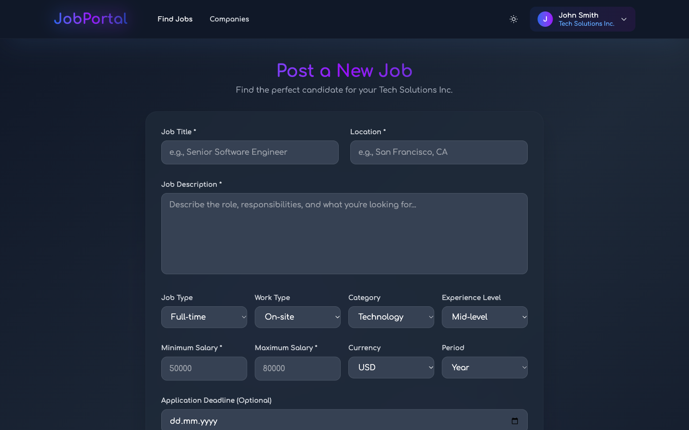 |

### Admin

| Dashboard | Company management |
| :---: | :---: |
| 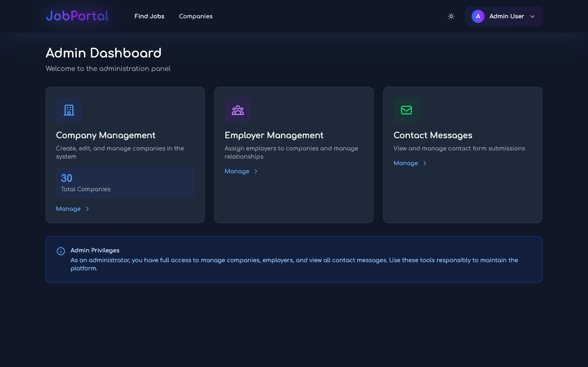 | 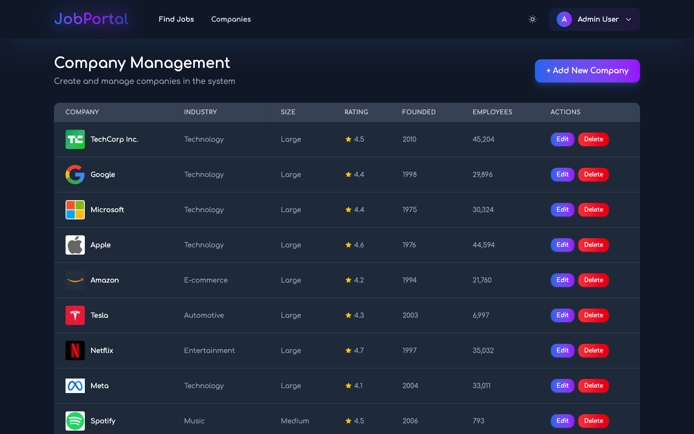 |

### Sign in and mobile

| Sign in | Mobile home | Mobile job search |
| :---: | :---: | :---: |
| 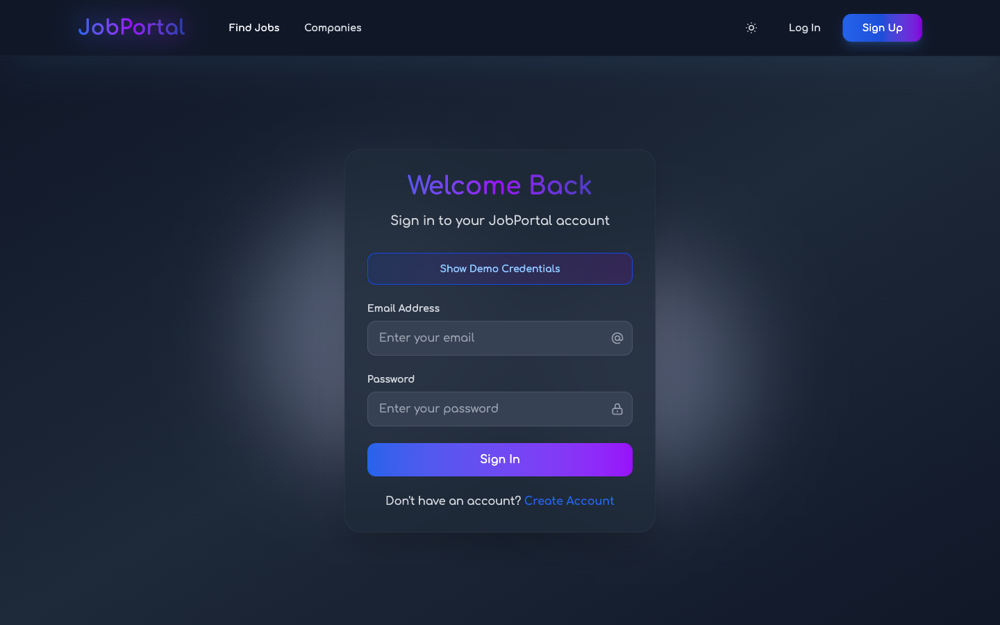 | 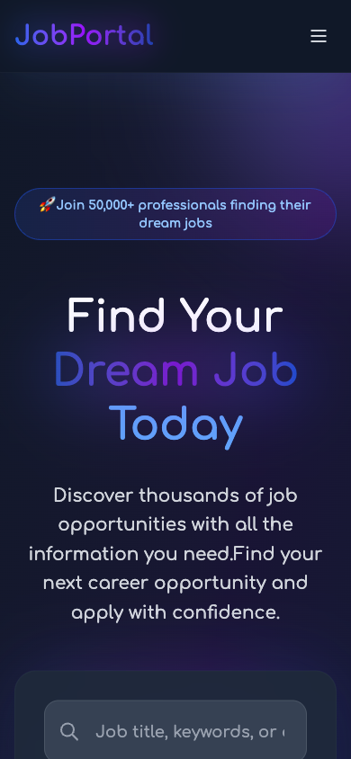 | 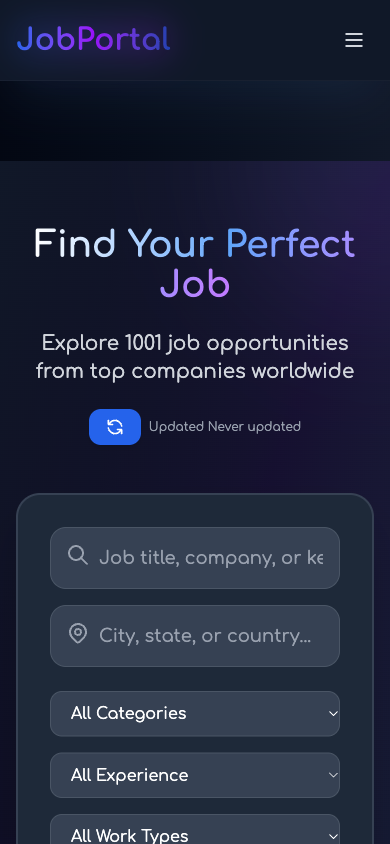 |

## Features

### For everyone
- **Job search** across 1,000+ listings, with keyword, location, category, experience level, work type and minimum salary filters, a remote-only toggle, sorting and pagination
- **Company directory** with industry, size and rating filters, plus a profile page for each company with its open positions, culture and benefits
- **Dark and light themes**, saved between visits
- **Responsive layout** from phone widths up
- **Per-route page titles and meta descriptions**
- **Contact form** whose messages show up in the admin panel

### Job seekers
- Build a profile with a photo and résumé, with a live completeness meter
- Save jobs to a bookmark list
- Apply to jobs (requires a complete profile), track application status and withdraw applications

### Employers
- Post jobs with salary range, requirements, benefits and deadline
- Manage your postings and update their status
- Review the applicants for each job, with their profile and résumé

### Admins
- Dashboard overview
- Create, edit and delete companies
- Assign employers to companies
- Read and manage contact messages

## Tech Stack

| Area | Tools |
| --- | --- |
| UI | [React 19](https://react.dev/), functional components and hooks |
| Build | [Vite 7](https://vite.dev/) with route-level code splitting (`React.lazy` + `Suspense`) |
| Styling | [Tailwind CSS 4](https://tailwindcss.com/) |
| Routing | [React Router 7](https://reactrouter.com/) with role-based route guards |
| State | React Context (no external state library) |
| Icons | [Font Awesome](https://fontawesome.com/) and [Lucide](https://lucide.dev/) |
| Notifications | [react-toastify](https://fkhadra.github.io/react-toastify/) |
| Quality | ESLint 9 (flat config) |

## Getting Started

### Prerequisites

- [Node.js](https://nodejs.org/) 20.19+ (required by Vite 7)
- npm

### Installation

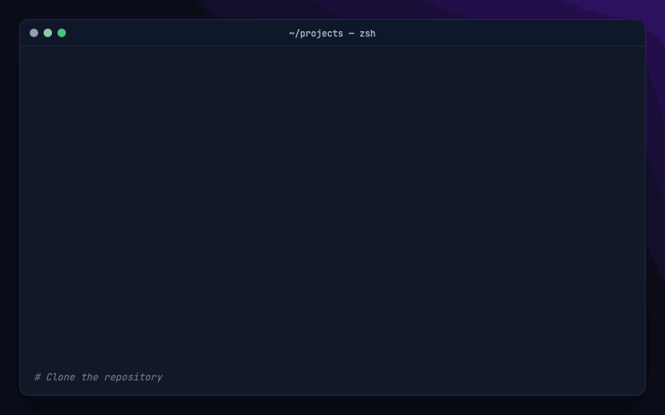

```bash
git clone https://github.com/mutkukucuk/job-portal-ui.git
cd job-portal-ui
npm install
npm run dev
```

Open http://localhost:5173 in your browser.

To create and preview a production build:

```bash
npm run build     # outputs to dist/
npm run preview   # serves dist/ locally
```

No backend, database or environment variables are needed. All data comes from the mock layer and is saved in your browser's `localStorage`.

## Demo Accounts

Sign in with one of these mock accounts. You can also click **Show Demo Credentials** on the sign-in page to fill them in.

| Role | Email | Password |
| --- | --- | --- |
| Job seeker | `jobseeker@email.com` | `jobseeker123` |
| Employer | `employer@company.com` | `employer123` |
| Admin | `admin@portal.com` | `admin123` |

> To apply for jobs as the job seeker, first complete the profile on the **My Profile** page.
>
> To reset the demo, clear the site's `localStorage` in your browser's dev tools.

## Available Scripts

| Command | Description |
| --- | --- |
| `npm run dev` | Start the Vite dev server with hot reload |
| `npm run build` | Create a production build in `dist/` |
| `npm run preview` | Serve the production build locally |
| `npm run lint` | Run ESLint over the project |

## Project Structure

```
job-portal-ui/
├── public/                 # Static assets (favicon, company logos)
├── docs/                   # README demo GIFs and screenshots
├── src/
│   ├── components/         # Shared UI: Navbar, Footer, Layout, ProtectedRoute, PageLoader…
│   ├── context/            # Core contexts: AuthContext, JobContext, ThemeContext
│   ├── contexts/           # Data-fetching contexts: JobsDataContext, CompaniesContext
│   ├── data/               # mockData.js: seeded jobs, companies and users
│   ├── pages/              # Route-level pages
│   │   └── admin/          # Admin-only pages
│   ├── services/           # Simulated async API services
│   ├── utils/              # Helpers (delay.js)
│   ├── App.jsx             # Router and provider tree
│   └── main.jsx            # Entry point
├── eslint.config.js
├── vite.config.js
└── index.html
```

## Architecture

### State management

State lives in two layers of React Context:

- **`src/context/`**: `AuthContext` handles sign-in, registration and session persistence. `JobContext` handles applications, saved jobs and employer job management. `ThemeContext` handles the theme.
- **`src/contexts/`**: `JobsDataContext` and `CompaniesContext` fetch and cache data with a 5-minute TTL. They refresh when the window regains focus.

The providers are nested in `App.jsx` in this order: `AuthProvider` → `JobsDataProvider` → `JobProvider` → `CompaniesProvider` → `ThemeProvider`.

### Data layer

There is no real backend. The services in `src/services/` act like an async API: every call waits on `delay()` to simulate network latency, then reads and writes `localStorage`. The seed data in `src/data/mockData.js` comes from a seeded random number generator, so job and company IDs stay the same across reloads.

Main `localStorage` keys:

| Key | Contents |
| --- | --- |
| `jobPortalUser`, `authToken` | Current session |
| `registeredUsers` | Accounts created through sign-up |
| `globalPostedJobs` | Jobs posted by employers (visible to everyone) |
| `userProfile_{userId}` | Job seeker profile |
| `savedJobIds_{userId}` | Saved jobs |
| `jobApplications_{userId}` | Applications |
| `postedJobs_{userId}` | An employer's own postings |
| `contactMessages` | Contact form submissions |
| `job-portal-theme` | Theme preference |

### Routing and roles

`ProtectedRoute` guards pages by role and sends signed-out users to the sign-in page:

| Role | Routes |
| --- | --- |
| Public | `/`, `/jobs`, `/jobs/:id`, `/companies`, `/companies/:id`, `/contact`, `/login`, `/register` |
| `ROLE_JOB_SEEKER` | `/profile`, `/applied-jobs`, `/saved-jobs` |
| `ROLE_EMPLOYER` | `/post-job`, `/employer/jobs`, `/job-applicants/:jobId` |
| `ROLE_ADMIN` | `/admin`, `/admin/companies`, `/admin/employers`, `/admin/contact-messages` |

## Contributing

Contributions are welcome.

1. Fork the repo and branch off `main` with a prefixed name, such as `feature/…`, `fix/…`, `docs/…`, `chore/…`, `refactor/…` or `style/…`.
2. Follow the project conventions:
   - plain JSX (no TypeScript)
   - functional components
   - tabs for indentation
   - Tailwind utility classes only
3. Write commit messages in [Conventional Commits](https://www.conventionalcommits.org/) style, for example `fix: correct role guard on employer routes`.
4. Run `npm run lint` and `npm run build` before you open a pull request against `main`, and include a summary and a test plan.

The full conventions are in [CLAUDE.md](CLAUDE.md).

## License

Released under the [MIT No Attribution License (MIT-0)](LICENSE). Use, copy, modify and distribute the code for any purpose, with no attribution required.

Company names and logos in the mock data belong to their respective owners and are used for demonstration only.
